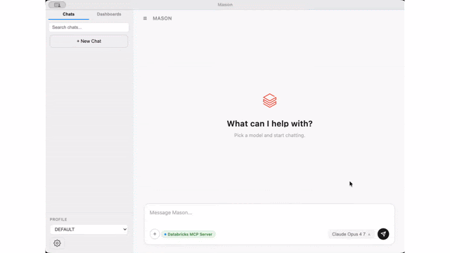

# Mason

Mason is a desktop application that leverages Databricks Unity AI Gateway and Unity Catalog to give your enterprise a central, governed, and powerful AI exerience. Interact with any foundational model provider or custom model you've built on databricks through a unified interface with MCP tool calling, local filesystem access, auto-discovered models, and access to Databricks Dashboards.

<p align="center">
  
</p>

## Installation

### macOS (Apple Silicon) — one-line install

```bash
curl -fsSL https://raw.githubusercontent.com/databricks-solutions/mason/main/scripts/install.sh | bash
```

This downloads the latest signed/notarized DMG from GitHub Releases, mounts it, copies `Mason.app` to `/Applications`, and unmounts. Pin to a specific version:

```bash
curl -fsSL https://raw.githubusercontent.com/databricks-solutions/mason/main/scripts/install.sh | bash -s v1.0.0
```

### macOS — manual install

Download `Mason-*-arm64.dmg` from [the latest release](https://github.com/databricks-solutions/mason/releases/latest), open it, and drag Mason to Applications.

### Windows (x64 or ARM64) — one-line install

Open PowerShell and run:

```powershell
irm https://raw.githubusercontent.com/databricks-solutions/mason/main/scripts/install.ps1 | iex
```

This auto-detects your architecture (x64 vs ARM64), downloads the matching installer from GitHub Releases, and runs it silently as a per-user install (no admin elevation). Mason launches automatically when it finishes. Pin to a specific version:

```powershell
$env:MASON_VERSION = "v1.3.13"; irm https://raw.githubusercontent.com/databricks-solutions/mason/main/scripts/install.ps1 | iex
```

### Windows — manual install

Download the matching `.exe` from [the latest release](https://github.com/databricks-solutions/mason/releases/latest) and run it:

- `Mason Setup X.Y.Z.exe` — x64 (Intel / AMD)
- `Mason Setup X.Y.Z-arm64.exe` — ARM64 (Surface Pro X, Copilot+ PCs)

Not sure which architecture you have? Settings → System → About → "System type".

### Linux

Linux builds aren't published yet. Build from source: `npm ci && npm run build:linux` produces an `.AppImage`.

## How to get help

Databricks support doesn't cover this content. For questions or bugs, please open a [GitHub issue](https://github.com/databricks-solutions/mason/issues) and the team will help on a best effort basis.

## License

&copy; 2026 Databricks, Inc. All rights reserved. The source in this repository is provided subject to the Databricks License [https://databricks.com/db-license-source]. All included or referenced third party libraries are subject to the licenses set forth below.
